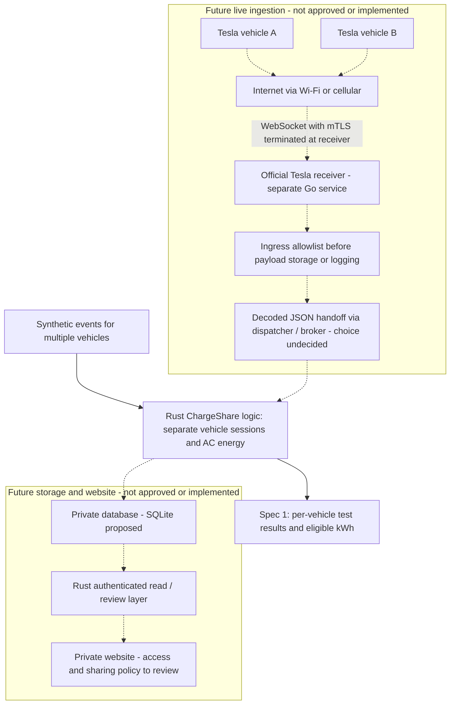

# Proposed architecture

> Proposed architecture and background research, not an approved implementation spec.
> Live collection, storage, billing and user access are outside Spec 1. Review [the fresh offline multi-vehicle proposal](../openspec/changes/offline-multi-vehicle-ledger/proposal.md)
> for its retained review context; later features need separately reviewed specs.

This is a design for later implementation. No receiver or application is deployed.

## Architecture at a glance

The solid path is the **implemented offline Spec 1 exercise**. All other
components remain proposed and unimplemented; dashed paths are future integrations requiring
separately reviewed specs and explicit approval.

The Go receiver is a separate process, not Go code embedded in Rust. Its proposed
handoff to Rust is decoded JSON through a supported dispatcher/broker, not a
stock Tesla HTTP webhook. Tesla documents decoded dispatcher output and options
such as Kafka; the broker and durability approach remain undecided. This
background comes from Tesla's Fleet Telemetry receiver configuration guidance;
it does not select or authorize an integration.

The allowlist box is a required ingress policy, not an implemented extra service.
A future integration must enforce it before any receiver sink, payload log or
broker persistence. Spec 1 bypasses all live transport, database and website
components: it exercises Rust domain behavior using fictional inputs only.
Neither a cloud nor home host is selected; a future receiver needs suitable
public reachability and security. The website must use authenticated application
access, never direct public database access; owner visibility remains a review
question rather than approved cross-owner sharing.

## Data flow and trust boundaries

1. Each separately approved vehicle sends Fleet Telemetry to Tesla's official receiver over its supported authenticated transport.
2. An ingress allowlist is enforced before any raw-payload persistence or logging. Unknown vehicle payloads are rejected without retention; the receiver must have no earlier unfiltered payload sink. Accepted evidence is persisted on encrypted private storage, then a small Rust processor normalizes it and records event-time and receipt-time separately.
3. SQLite holds immutable evidence references, derived sessions, versioned tariffs and review decisions. Replay is deterministic and transactional.
4. A private authenticated session view and CSV exporter present quality flags, manual shared-charger labels and reproducible monthly estimates.

One always-on host with persistent storage is sufficient for this scale. Keep mTLS/WebSocket termination at the official receiver; a generic TLS-terminating reverse proxy must not silently remove Tesla's authentication guarantees. The future dashboard is private. The only public surfaces would be the required telemetry listener and Tesla's public-key discovery path. Do not expose the database, raw files, command proxy or debug endpoints.

## Language boundary

Implement ChargeShare ingestion adapters, session reconstruction, tariff calculations, private view and CSV in Rust. Keep Tesla's official Go receiver as a separate external service; do not rewrite its vehicle protocol. The current Cargo workspace contains only an empty core library. SQLite and the private view remain proposed integrations, not dependencies that have been selected or wired yet. Node.js/npm runs OpenSpec and development checks, not the application backend.

## Proposed records

- Raw event: private vehicle identity, source timestamp, receipt timestamp, field/value/unit, invalid status, payload hash, original evidence reference, schema version
- Counter segment: valid baseline/end sample, nonnegative deltas, timestamp interval, reset or gap reason
- Session: synthetic internal ID, connection evidence, charge intervals, AC/DC status, segments, start/end uncertainty, quality flags, manual charger label and review notes
- Tariff version: currency, IANA timezone, effective dates, rate windows, calendar/holiday rules and agreed variable charges
- Statement revision: month, session IDs and versions, tariff versions, energy/cost breakdown, quality decisions, rounding policy and generation time

Actual VINs and raw payloads are runtime private data, never repository fixtures. UI/CSV uses internal session and vehicle aliases by default.

## Energy and session decisions

Use cumulative `ACChargingEnergyIn` differences within a validated counter segment. `ACChargingPower`, `DetailedChargeState` and `ChargingCableType` help explain activity and eligibility. Begin with conservative proposed reporting intervals, then validate actual changed-value behavior. Absence of messages is not proof of zero consumption or the end of a session.

Reconnects, pauses and restarts must not create duplicate billable energy. Sort by event time with deterministic tie-breaking, retain receipt order for diagnostics, deduplicate identical events and replay on late arrivals. A counter rollback starts a candidate new segment and blocks finalization until its meaning is resolved. Do not add a last power reading across a long gap or extrapolate from state of charge.

## Pricing decisions

Split measured intervals at tariff boundaries, midnight, month-end and tariff effective dates in the configured IANA timezone. Store UTC instants; local repeated/skipped hours must map unambiguously. Use decimal arithmetic and round the statement under an explicit policy. A short boundary-crossing interval can use a documented estimate; a long ambiguous interval remains held for review or shows a range.

Tariffs and measurement decisions remain versioned so a statement is reproducible. A review correction creates a new revision; it must not silently change a previously exported total. Payment execution is outside the product.

## Alternatives deferred

- Battery energy (`charge_energy_added`) is a different measurement boundary and is unsuitable as an unexplained substitute for AC-input energy
- Repeated Fleet API polling or waking the vehicle adds cost and does not supply the intended telemetry evidence
- Automatic GPS geofencing adds sensitive data collection before it is needed; manual shared-charger confirmation is the first-version gate
- Charger-side integration may provide a better meter reference later, subject to owner permission and hardware capability
- Broker choice, extra services and multi-tenant database design remain deferred until the receiver handoff and reliability requirements are reviewed

See [initial plan](initial-plan.md) for background and source attribution, and [measurement](measurement.md) for validation limits.
